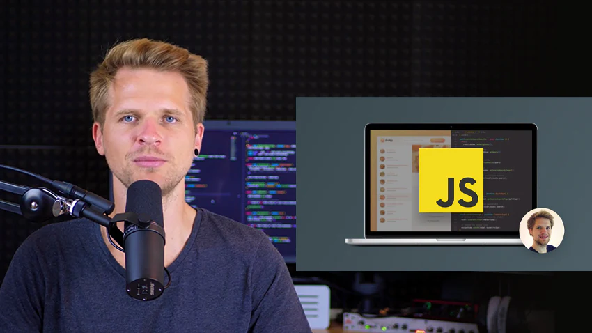

#### <a href="https://www.udemy.com/course/the-complete-javascript-course/" target="_blank" alt="Scrimba's website">JONAS SCHMEDTMANN | THE COMPLETE JAVASCRIPT COURSE 2023 ...
</a> 

This repository is for the Udemy course course provided by Jonas Schmedtmann. This is to supplement the Scrimba course.

 

 

#### ABOUT
## What is the repository all about?
The plan with this repo is to store all my notes from this course, each module or section can be found under its own `.md` file.

## What can you expect from this repository?
All of my notes will be stored within a `.md` file under each respective folder. I would glady make a site and place all my notes there once the course is completed and I have gained insight into React. 

If a visual example is needed, I would most likely use <a href="https://codepen.io/trending">CodePen</a> for quick demonstrations, and for full projects they will have their own repository with a link pointing to that repository and live version, which is either hosted here on GitHub Pages or Netlify depending on the project needs.

 

#### FOLDER STRUCTURE
## Repository files & directory layout

- [assets/](./assets/)
- [module-1/](./module-1/)
- [module-2/](./module-2/)
  - [assets/](./module-2/assets/)
  - [index.html](./module-2/index.html)
- [README.md](./README.md)

 

#### SOURCES
## Sources used within this repository

- Jonas Schmedtmann Course on Udemy
  - <a href="https://www.udemy.com/course/the-complete-javascript-course/">The Complete JavaScript Course 2023: From Zero to Expert!</a>
